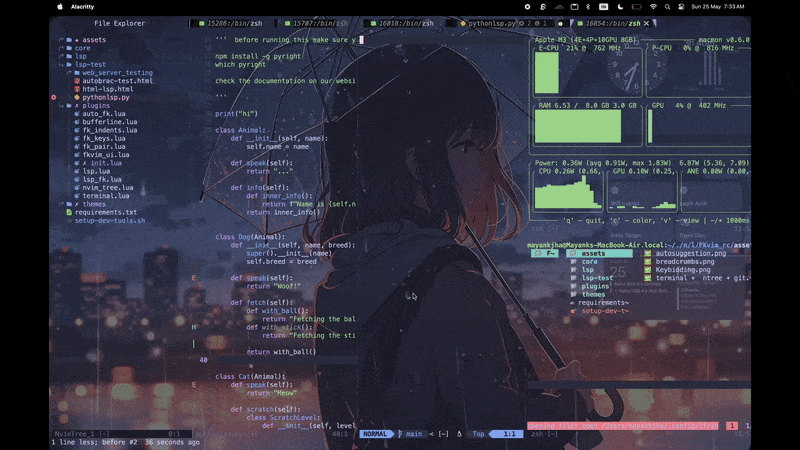

# 🌟 The FKvim Editor
The Fuck Vim (Commanly Known as FKvim) is highly optimizable and customizable neovim based Editor which all the built-in features of modern IDE. FKvim was started as a personal project. 

> A fast, modern, and minimal Neovim setup built with [lazy.nvim](https://github.com/folke/lazy.nvim).  
> Features LSP, autocompletion, fuzzy finding, file tree, git integration, and more!
[The FKvim Project.pdf](https://github.com/flashcodes-themayankjha/FKvim/files/11995661/The.FKvim.Project.pdf)
---

## 📸 Screenshots
*Automcompletion with cmp*


*Advance VScode Like Features*


*VS Code like Terminal + File Manager + git Integration *




*Figure 1: Demo of terminal, file tree, and Git integration*

---

## ✨ Features

- 🚀 Blazing fast startup using **lazy.nvim**
- 🎨 Beautiful UI with **Catppuccin** theme
- 🧠 Powerful autocomplete with **nvim-cmp**
- 🔍 Fuzzy file finding with **Telescope**
- 🖼 Transparent background support
- 📂 File explorer using **nvim-tree**
- 🧩 LSP + TypeScript support via `tsserver`
- 📑 Bufferline, Statusline (lualine), Dashboard
- 🐙 Git integration with **Gitsigns**
- 💬 Commenting made easy

---

## ⚡ Installation

### 1. Install Neovim (>= 0.9)

- [Neovim Installation Guide](https://github.com/neovim/neovim/wiki/Installing-Neovim)
### 2. Clone this repo into your Neovim config folder

```bash
git clone https://github.com/flashcodes-themayankjha/FKvim
```


=======
####  2.1  if your staring directory is  FKvim/lua instead of lua/FKvim_rc  


```bash
git clone  https://github.com/flashcodes-themayankjha/FKvim  temp/FKvim
mkdir -p  ~/.config/nvim
mv temp/FKvim/* ~/.config/nvim/
rm -rf temp/FKvim
```

---

### 3. Open Neovim

Just open Neovim normally:

```bash
nvim
```

The plugins will auto-install on first launch. 🚀

> If nothing happens, run `:Lazy` and hit "Install".

---
### 3.1 Open Neovim (Adding FKvim as Default Vim)(Optional)
open ~/.zshrc or ~/.bashrc - Your Prefered Shell Script 
and add 

```bash
echo "alias fk='nvim'" >> ~/.zshrc
echo "alias fk_all='nvim .'" >> ~/.zshrc
echo "alias fk.config='fk_all ~/.config/nvim/lua/FKvim_rc'" >> ~/.zshrc
source ~/.zshrc
```
### ✅ Alias Usage

| Alias         | Expands To                                      | Description                                      |
|---------------|--------------------------------------------------|--------------------------------------------------|
| `fk`          | `nvim`                                           | Opens Neovim                                     |
| `fk_all`      | `nvim .`                                         | Opens Neovim in the current directory            |
| `nvim_config` | `fk_all ~/.config/nvim/lua/FKvim_rc`             | Opens your Neovim config directory in Neovim     |


## 🔧 Manual Dependencies

Some plugins need external tools. Install them with:

```bash
# Ubuntu/Debian
sudo apt install ripgrep fd-find

# macOS
brew install ripgrep fd

# Arch Linux
sudo pacman -S ripgrep fd
```

---

## 🛠 Plugin Highlights

| Plugin | Purpose |
|:------|:--------|
| [lazy.nvim](https://github.com/folke/lazy.nvim) | Plugin manager |
| [nvim-cmp](https://github.com/hrsh7th/nvim-cmp) | Autocompletion |
| [nvim-lspconfig](https://github.com/neovim/nvim-lspconfig) | Language Server Protocol |
| [telescope.nvim](https://github.com/nvim-telescope/telescope.nvim) | Fuzzy Finder |
| [nvim-tree.lua](https://github.com/nvim-tree/nvim-tree.lua) | File Explorer |
| [catppuccin](https://github.com/catppuccin/nvim) | Color Theme |
| [gitsigns.nvim](https://github.com/lewis6991/gitsigns.nvim) | Git integration |
| [bufferline.nvim](https://github.com/akinsho/bufferline.nvim) | Tabs/Buffer management |
| [toggleterm.nvim](https://github.com/akinsho/toggleterm.nvim) | Integrated Terminal |
| [dashboard-nvim](https://github.com/glepnir/dashboard-nvim) | Start Screen |


---

## 🧠 Future Enhancements

- Add Treesitter configs for better syntax highlighting
- Extend LSPs for more languages
- Add DAP (Debug Adapter Protocol) support

---

## 📜 License

This config is free to use under the [MIT License](LICENSE).

---

## 🙌 Credits

- [Lazy.nvim](https://github.com/folke/lazy.nvim)
- [Catppuccin](https://github.com/catppuccin/nvim)
- [nvim-telescope](https://github.com/nvim-telescope/telescope.nvim)
- And many more awesome open-source contributors 💖

---

### 🚀 Made with ❤️ by [Mayank Kumar Jha]
---


## Authors

- [@FlashCodes-Mayankjha](https://github.com/flashcodes-themayankjha) from Flashcode Teams 

